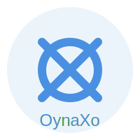

# 🎮 OynaXo

  
  
  <h1>Modern 3 Taş Zeka Oyunu</h1>
  
Klasik zeka oyununun yeni nesil versiyonu

## 🎯 Öne Çıkan Özellikler

  <table>
    <tr>
      <td align="center">
        
         
        <b>Yapay Zeka</b>
         
        <small>3 Zorluk Seviyesi</small>
      </td>
      <td align="center">
        
         
        <b>Çevrimiçi</b>
         
        <small>Arkadaşlarla Oyna</small>
      </td>
      <td align="center">
        
         
        <b>Çevrimdışı</b>
         
        <small>Pass & Play</small>
      </td>
    </tr>
  </table>

## 📱 Ekran Görüntüleri

  

## 🎮 Oyun Modları

  <table>
    <tr>
      <td align="center">
        <h3>🤖 Tek Oyunculu</h3>
        <ul style="list-style: none; padding: 0;">
          <li>Yapay zeka ile karşılaşma</li>
          <li>3 zorluk seviyesi</li>
          <li>İstatistik takibi</li>
        </ul>
      </td>
      <td align="center">
        <h3>👥 İki Oyunculu</h3>
        <ul style="list-style: none; padding: 0;">
          <li>Çevrimiçi oyun</li>
          <li>Pass & Play</li>
          <li>Özel odalar</li>
        </ul>
      </td>
    </tr>
  </table>

## 🌍 Dil Desteği

  
  
  

## ⭐ Neden OynaXo?

  <table>
    <tr>
      <td align="center">
        <b>🎯 Modern Tasarım</b>
         
        <small>Klasik oyunu modern arayüzle buluşturur</small>
      </td>
      <td align="center">
        <b>🧠 Zeka Geliştirici</b>
         
        <small>Strateji ve düşünme becerilerini geliştirir</small>
      </td>
      <td align="center">
        <b>🌐 Her Yerde Oyna</b>
         
        <small>Çevrimiçi ve çevrimdışı oynanabilir</small>
      </td>
    </tr>
  </table>

## 📱 Hemen İndir

  <table>
    <tr>
      <td align="center">
        <h3>🍎 iOS</h3>
        
      </td>
      <td align="center">
        <h3>🤖 Android</h3>
        
      </td>
    </tr>
  </table>

## 📞 İletişim

  <a href="https://oynaxo.web.app">🌐 Website</a> •
  <a href="mailto:info@oynaxo.com">📧 Email</a> •
  <a href="https://twitter.com/oynaxo">🐦 Twitter</a> •
  <a href="https://instagram.com/oynaxo">📸 Instagram</a>

---

  Built with ❤️ by OynaXo Team

 